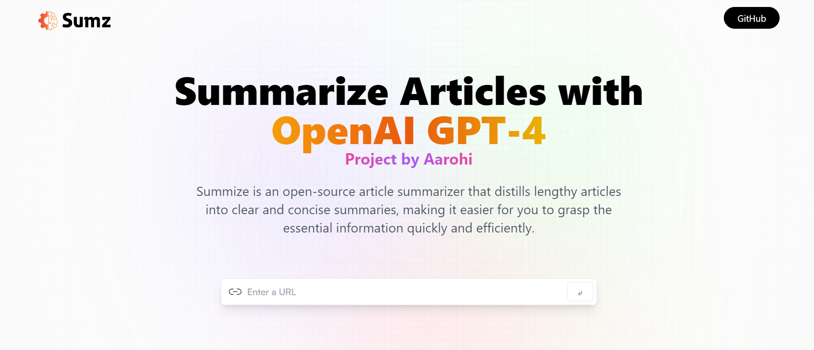

# OpenAI Article Summarizer

Summarize any kind of article with just one click using the powerful OpenAI model.

## Table of Contents

- [Introduction](#introduction)
- [Features](#features)
- [Technologies Used](#technologies-used)
- [Usage](#usage)
- [Contact](#contact)

## Introduction

The OpenAI Article Summarizer is a web application that allows users to quickly and easily summarize articles using the powerful OpenAI model. This tool is perfect for anyone who needs to get the gist of an article without spending too much time reading.

## Project Demo

## Features

- **URL Input**: Summarize articles directly from a URL.
- **History Saving**: Save summaries locally for future reference.
- **Copy to Clipboard**: Easily copy the summary to your clipboard.
- **RTK Query**: Efficient data fetching and state management with Redux Toolkit Query.

## Technologies Used

- **Frontend**: React, JavaScript, Tailwind CSS, Bootstrap
- **Backend**: Node.js, Express
- **State Management**: Redux Toolkit (RTK) Query
- **API**: OpenAI API
- **Storage**: Local Storage

## Usage

1. Enter the URL of the article you want to summarize.
2. Click the "Summarize" button.
3. View the summary, copy it to your clipboard, or save it for later.

## Contact

For any inquiries or feedback, please contact:

- **Name**: Aarohi
- **Email**: your-email@example.com
- **GitHub**: [yourusername](https://github.com/yourusername)

